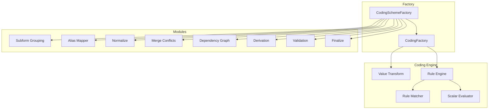
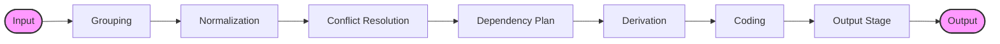
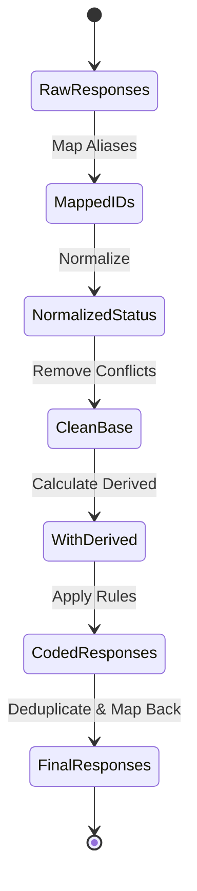
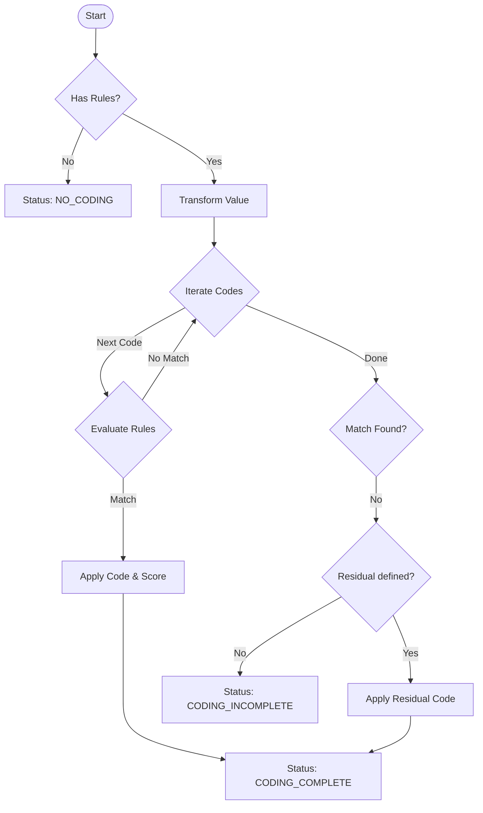
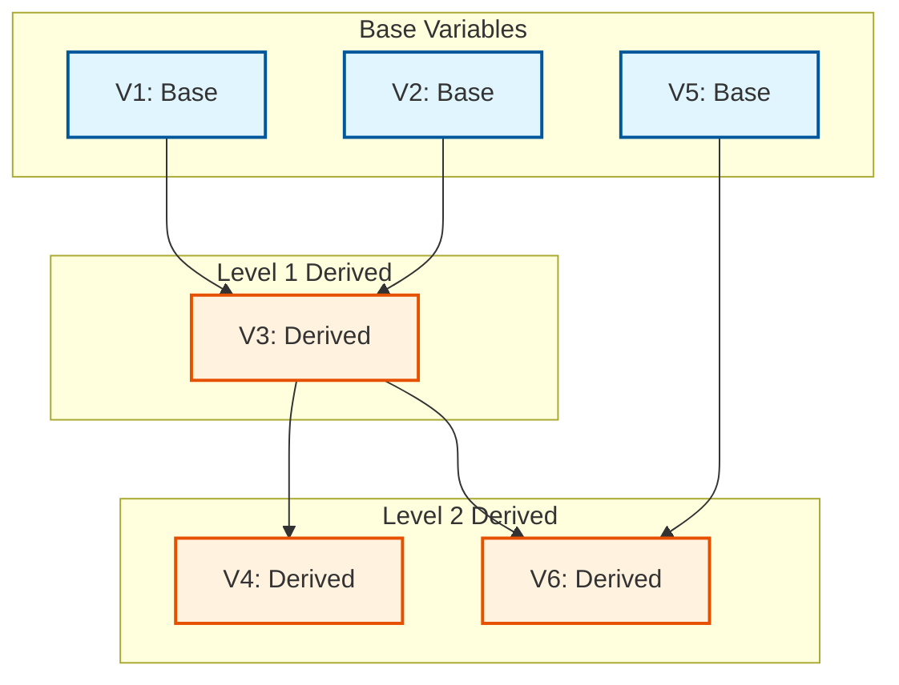

# Coding Process Documentation

## Overview

This document explains the internal logic and architecture of the `@iqb/responses` package, which provides automatic coding functionality for assessment data. The package processes responses according to a coding scheme, applying derivations and rule-based coding to generate codes and scores.

## Table of Contents

1. [High-Level Architecture](#high-level-architecture)
2. [Coding Pipeline Flow](#coding-pipeline-flow)
3. [Rule-Based Coding Logic](#rule-based-coding-logic)
4. [Dependency Resolution](#dependency-resolution)
5. [Key Components](#key-components)
6. [Status Flow](#status-flow)
7. [Error Handling](#error-handling)

---

## High-Level Architecture

The coding system is built around two main factories:

- **`CodingFactory`**: Handles coding of individual responses
- **`CodingSchemeFactory`**: Orchestrates the entire coding pipeline for multiple responses

### Main Entry Points

```typescript
// Code all responses with a coding scheme
CodingSchemeFactory.code(responses, variableCodings, options)

// Code a single response
CodingFactory.code(response, coding, options)
```

### Module Architecture



The system is organized into specialized modules, each handling a specific aspect of the coding process:

- **CodingSchemeFactory**: Main orchestrator that coordinates all modules
- **Subform Grouping**: Groups responses by subform for independent processing
- **Alias Mapper**: Maps between variable IDs and aliases
- **Normalize**: Standardizes response statuses and handles empty values
- **Merge**: Resolves conflicts between derived and base variables
- **Graph**: Builds dependency trees for derived variables
- **Derive**: Handles derivation planning, execution, and value computation
- **CodingFactory**: Applies coding rules to individual responses
- **Rule Engine**: Evaluates coding rules (matching, scalar evaluation, array handling)
- **Value Transform**: Transforms values (fragmenting, sorting, type conversion)
- **Finalize**: Deduplicates and finalizes responses
- **Validation**: Validates coding schemes against base variables

---

## Coding Pipeline Flow



The complete coding pipeline consists of the following stages:

### Data Flow Through the Pipeline



This diagram shows how data is transformed at each stage of the pipeline:

1. **Alias Mapping**: Responses are mapped from external aliases to internal IDs
2. **Normalization**: Statuses are standardized and empty values are handled
3. **Dependency Planning**: The dependency graph is built and execution order is determined
4. **Derivation**: Derived variables are computed from their sources
5. **Coding**: Rules are evaluated and codes/scores are applied
6. **Finalization**: Responses are mapped back to aliases and deduplicated

### Detailed Stage Descriptions

### 1. **INPUT Stage**
- **Input**: Array of `Response` objects and `VariableCodingData[]` (coding scheme)
- **Purpose**: Accept raw responses and coding configuration

### 2. **GROUPING Stage**
- **Module**: `src/subform/grouping.ts`
- **Function**: `groupResponsesBySubform()`
- **Purpose**: Separate responses into subform groups
- **Logic**: 
  - Responses with a `subform` property are grouped together
  - Responses without subform are processed separately
  - Each group is coded independently

### 3. **NORMALIZATION Stage**
- **Module**: `src/normalize/response-status.ts`
- **Functions**:
  - `normalizeDisplayedToValueChanged()`
  - `normalizeNotReachedToValueChanged()`
  - `markEmptyValuesInvalidForBaseUnlessAllowed()`
- **Purpose**: Standardize response statuses based on variable configuration
- **Transformations**:
  - `DISPLAYED` → `VALUE_CHANGED` (if `TAKE_DISPLAYED_AS_VALUE_CHANGED` is set)
  - `NOT_REACHED` → `VALUE_CHANGED` (if `TAKE_NOT_REACHED_AS_VALUE_CHANGED` is set)
  - Empty values → `INVALID` (for BASE variables unless `TAKE_EMPTY_AS_VALID` is set)

### 4. **CONFLICT RESOLUTION Stage**
- **Module**: `src/merge/resolve-derived-conflicts.ts`
- **Function**: `removeBaseResponsesShadowedByDerived()`
- **Purpose**: Remove base responses that are shadowed by derived variables
- **Logic**: If a derived variable has the same ID as a base variable, the base response is removed to avoid conflicts

### 5. **DEPENDENCY PLANNING Stage**
- **Module**: `src/derive/dependency-plan.ts`
- **Function**: `buildDependencyPlan()`
- **Purpose**: Create an execution plan for derived variables
- **Process**:
  1. Build dependency graph using `getVariableDependencyTree()`
  2. Topologically sort variables to ensure dependencies are processed first
  3. Create execution plan with correct ordering

### 6. **DERIVATION Stage**
- **Module**: `src/derive/derive-value.ts`
- **Function**: `deriveValue()`
- **Purpose**: Compute values for derived variables
- **Supported Derivation Methods**:
  - `SUM`: Sum of source values
  - `SUM_CODE`: Sum of source codes
  - `SUM_SCORE`: Sum of source scores
  - `UNIQUE_VALUES`: Unique values from sources
  - `SOLVER`: Mathematical expression evaluation
  - `ATTACHMENT`: Attach source values
  - `CONCAT_CODE`: Concatenate source codes
  - `CONCAT_TEXT`: Concatenate source values as text

### 7. **CODING Stage**
- **Module**: `src/coding-factory.ts`
- **Function**: `CodingFactory.code()`
- **Purpose**: Apply rule-based coding to responses with `VALUE_CHANGED` status
- **Process**: See [Rule-Based Coding Logic](#rule-based-coding-logic) section

### 8. **OUTPUT Stage**
- **Module**: `src/finalize/finalize-and-deduplicate.ts`
- **Function**: `finalizeAndDeduplicateResponses()`
- **Purpose**: Clean up and deduplicate responses
- **Output**: Array of coded `Response` objects with codes, scores, and statuses

---

## Rule-Based Coding Logic



The rule-based coding process follows this decision flow:

### Step 1: Check for Coding Rules
- **Condition**: Does the variable have any coding rules?
- **No**: Set status to `NO_CODING` and return
- **Yes**: Continue to transformation

### Step 2: Transform Value
- **Module**: `src/value-transform.ts`
- **Function**: `transformValue()`
- **Operations**:
  - Apply fragmenting pattern (split value into array)
  - Sort array if `SORT_ARRAY` processing is enabled
  - Convert to appropriate type (string/number)
- **Error Handling**: If transformation fails, set status to `CODING_ERROR`

### Step 3: Iterate Through Code Rules
- **Module**: `src/rule-engine/rule-set-evaluator.ts`
- **Process**:
  1. For each code in the coding scheme:
     - Check if code type is `RESIDUAL_AUTO` or `INTENDED_INCOMPLETE` (save for later)
     - Evaluate all rule sets for the code
     - If `ruleSetOperatorAnd` is true: ALL rule sets must match
     - If `ruleSetOperatorAnd` is false: ANY rule set must match

### Step 4: Rule Matching
- **Module**: `src/rule-engine/rule-matcher.ts`
- **Supported Rule Types**:
  - `MATCH`: Exact string match
  - `MATCH_REGEX`: Regular expression match
  - `NUMERIC_MATCH`: Exact numeric match
  - `NUMERIC_LESS_THAN`: Value < threshold
  - `NUMERIC_MORE_THAN`: Value > threshold
  - `NUMERIC_RANGE`: min ≤ value ≤ max
  - `NUMERIC_FULL_RANGE`: min ≥ value ≥ max
- **Processing Options**:
  - `IGNORE_CASE`: Case-insensitive matching
  - `IGNORE_ALL_SPACES`: Remove all whitespace
  - `IGNORE_DISPENSABLE_SPACES`: Normalize whitespace

### Step 5: Apply Code
- **If Match Found**:
  - Set `response.code` to the matched code ID
  - Set `response.score` to the code's score
  - Set `response.status` to `CODING_COMPLETE`
  - Special cases:
    - If code ID is `INVALID`: status = `INVALID`, code = 0, score = 0
    - If code type is `INTENDED_INCOMPLETE`: status = `INTENDED_INCOMPLETE`

### Step 6: Handle No Matches
- **If No Match Found**:
  - Check for `RESIDUAL_AUTO` code (catch-all)
  - **Has Residual**: Apply residual code and score, status = `CODING_COMPLETE`
  - **No Residual**: Set status to `CODING_INCOMPLETE`

---

## Dependency Resolution



### Dependency Graph Construction

The system builds a dependency graph to ensure derived variables are processed in the correct order:

#### Example Scenario

Given these variables:
- **V1** (BASE): Raw response from assessment
- **V2** (BASE): Raw response from assessment
- **V3** (DERIVED from V1, V2): Computed from V1 and V2
- **V4** (DERIVED from V3): Computed from V3
- **V5** (BASE): Raw response from assessment
- **V6** (DERIVED from V3, V5): Computed from V3 and V5

#### Execution Order

1. **Process BASE variables** (V1, V2, V5)
   - These have no dependencies
   - Can be processed in any order or in parallel

2. **Process V3** (depends on V1, V2)
   - Must wait for V1 and V2 to be processed
   - Derives value from V1 and V2

3. **Process V4** (depends on V3)
   - Must wait for V3 to be processed
   - Derives value from V3

4. **Process V6** (depends on V3, V5)
   - Must wait for V3 and V5 to be processed
   - Derives value from V3 and V5

### Implementation

**Module**: `src/graph/dependency-tree.ts`

```typescript
// Build dependency tree
const tree = getVariableDependencyTree(variableCodings);

// Each node contains:
{
  id: string,           // Variable ID
  alias: string,        // Variable alias
  sourceType: string,   // 'BASE' or derivation type
  children: [],         // Variables that depend on this one
  depth: number         // Depth in dependency tree
}
```

### Circular Dependency Detection

The system detects circular dependencies during graph construction and will report them as validation errors.

---

## Key Components

### 1. CodingFactory (`src/coding-factory.ts`)

**Purpose**: Code individual responses

**Key Methods**:
- `code(response, coding, options)`: Main coding function
- `isMatchRuleSet()`: Evaluate if a rule set matches
- `createCodingVariable()`: Create a coding variable structure
- `getValueAsString()`: Convert value to string with processing
- `getValueAsNumber()`: Convert value to number
- `isEmptyValue()`: Check if value is empty

### 2. CodingSchemeFactory (`src/coding-scheme-factory.ts`)

**Purpose**: Orchestrate the complete coding pipeline

**Key Methods**:
- `code(responses, variableCodings, options)`: Main entry point
- `buildCodingPipeline()`: Construct the processing pipeline
- `getVariableDependencyTree()`: Build dependency graph
- `validate()`: Validate coding scheme against base variables
- `getBaseVarsList()`: Get required base variables for target variables

### 3. Rule Engine (`src/rule-engine/`)

**Components**:
- `rule-set-evaluator.ts`: Evaluate rule sets
- `rule-matcher.ts`: Match individual rules
- `scalar-evaluator.ts`: Evaluate scalar rules (numeric, string)
- `array-position.ts`: Handle array position matching

### 4. Derivation System (`src/derive/`)

**Components**:
- `derive-value.ts`: Compute derived values
- `dependency-plan.ts`: Plan derivation execution order
- `derivation-traversal.ts`: Execute derivations in order

### 5. Value Transformation (`src/value-transform.ts`)

**Purpose**: Transform response values for coding

**Operations**:
- Fragmenting: Split strings into arrays
- Sorting: Sort array values
- Type conversion: String ↔ Number
- Processing: Apply transformations (lowercase, trim, etc.)

---

## Status Flow

### Response Status Values

| Status | Meaning |
|--------|---------|
| `UNSET` | Response not yet set |
| `VALUE_CHANGED` | Response value has changed, ready for coding |
| `DISPLAYED` | Response was displayed but not changed |
| `NOT_REACHED` | Response was not reached by test-taker |
| `CODING_COMPLETE` | Coding successfully applied |
| `CODING_INCOMPLETE` | No matching code found |
| `CODING_ERROR` | Error during coding process |
| `DERIVE_ERROR` | Error during derivation |
| `INVALID` | Response value is invalid |
| `INTENDED_INCOMPLETE` | Intentionally incomplete response |
| `NO_CODING` | No coding rules defined |

### Typical Status Transitions

#### Base Variable Flow
```
UNSET → VALUE_CHANGED → CODING_COMPLETE
                      → CODING_INCOMPLETE
                      → CODING_ERROR
                      → INVALID
                      → NO_CODING
```

#### Derived Variable Flow
```
(derived) → VALUE_CHANGED → CODING_COMPLETE
                          → DERIVE_ERROR
```

---

## Error Handling

### Error Callback

Both `CodingFactory.code()` and `CodingSchemeFactory.code()` accept an optional `onError` callback:

```typescript
const coded = CodingSchemeFactory.code(responses, variableCodings, {
  onError: (error) => {
    console.error('Coding error:', error);
    // Log to monitoring system, etc.
  }
});
```

### Error Types

1. **Transformation Errors**
   - Invalid regex patterns
   - Invalid fragmenting patterns
   - Type conversion failures
   - **Result**: Status set to `CODING_ERROR`

2. **Derivation Errors**
   - Invalid solver expressions
   - Missing source responses
   - Type mismatches
   - **Result**: Status set to `DERIVE_ERROR`, value cleared

3. **Validation Errors**
   - Circular dependencies
   - Missing source variables
   - Duplicate IDs/aliases
   - Invalid rule parameters
   - **Result**: Returned from `validate()` method

### Error Recovery

- Errors in one response don't stop processing of other responses
- Each response is processed independently
- Error status is set on the response object
- Original value is preserved (except for derivation errors)

---

## Advanced Features

### Alias Mapping

**Module**: `src/mapping/alias-mapper.ts`

The system supports both `id` and `alias` for variables:
- Internally, processing uses `id`
- Externally, responses use `alias`
- Automatic mapping between the two

```typescript
// Input: responses with aliases
// Internal: mapped to IDs
// Output: mapped back to aliases
```

### Subform Support

**Module**: `src/subform/grouping.ts`

Responses can have a `subform` property:
- Responses are grouped by subform
- Each subform group is coded independently
- Final responses are merged and deduplicated

### Processing Parameters

Variables can have processing parameters that affect how values are handled:

- `TO_LOWER_CASE`: Convert to lowercase
- `TO_NUMBER`: Convert to number
- `REMOVE_ALL_SPACES`: Remove all whitespace
- `REMOVE_DISPENSABLE_SPACES`: Normalize whitespace
- `TAKE_DISPLAYED_AS_VALUE_CHANGED`: Treat DISPLAYED as VALUE_CHANGED
- `TAKE_NOT_REACHED_AS_VALUE_CHANGED`: Treat NOT_REACHED as VALUE_CHANGED
- `TAKE_EMPTY_AS_VALID`: Allow empty values
- `SORT`: Sort array values
- `SORT_ARRAY`: Sort array before coding

---

## Performance Considerations

### Optimization Strategies

1. **Map-based Lookups**: Variables are indexed by ID and alias using `Map` for O(1) lookup
2. **Dependency Caching**: Dependency graph is computed once and reused
3. **Early Termination**: Rule evaluation stops at first match
4. **Subform Isolation**: Subforms are processed independently (potential for parallelization)

### Complexity

- **Time Complexity**: O(n × m × r) where:
  - n = number of responses
  - m = number of variables
  - r = average number of rules per variable
  
- **Space Complexity**: O(n + m) for storing responses and variable definitions

---

## Testing

The package includes comprehensive unit tests:

- **Location**: `test/` directory
- **Framework**: Jest
- **Coverage**: 80%+ for critical business logic
- **Test Types**:
  - Unit tests for individual functions
  - Integration tests for complete coding pipeline
  - Edge case tests for error handling

### Running Tests

```bash
# Run all tests
npm test

# Run with coverage
npm run test:coverage

# Run specific test suite
npm run test_coding
```

---

## Debugging Tips

### Enable Error Logging

```typescript
const coded = CodingSchemeFactory.code(responses, variableCodings, {
  onError: (error) => {
    console.error('Error details:', error);
    console.trace(); // Stack trace
  }
});
```

### Inspect Dependency Tree

```typescript
const tree = CodingSchemeFactory.getVariableDependencyTree(variableCodings);
console.log(JSON.stringify(tree, null, 2));
```

### Validate Coding Scheme

```typescript
const problems = CodingSchemeFactory.validate(baseVariables, variableCodings);
problems.forEach(p => {
  console.log(`${p.type}: ${p.variableId} - ${p.message}`);
});
```

### Check Required Base Variables

```typescript
const required = CodingSchemeFactory.getBaseVarsList(['V3', 'V4'], variableCodings);
console.log('Required base variables:', required);
```

---

## Version History

### Version 5.0 (Current)
- Comprehensive refactoring and modularization
- Improved validation with detailed error reporting
- Robust error handling for edge cases
- Performance improvements with Map-based lookups
- Extensive unit test coverage
- CI/CD with GitHub Actions and Dependabot

### Previous Versions
See [README.md](./README.md) for complete version history.

---

## References

- [IQB Specifications](https://iqb-specifications.github.io/)
- [Coding Documentation (German)](https://iqb-berlin.github.io/tba-info/coding/response-status.html)
- [Package on npm](https://www.npmjs.com/package/@iqb/responses)
- [GitHub Repository](https://github.com/iqb-berlin/responses)

---

## Contributing

When modifying the coding logic:

1. **Understand the pipeline**: Review this document and the flow diagrams
2. **Maintain backwards compatibility**: Existing coding schemes must continue to work
3. **Add tests**: Include unit tests for new functionality
4. **Update documentation**: Keep this document in sync with code changes
5. **Validate**: Run `validate()` to ensure coding schemes remain valid

---

## License

MIT License - See [LICENSE](./LICENSE) file for details.
