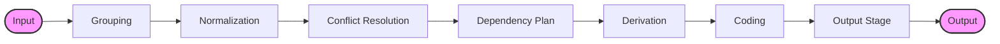
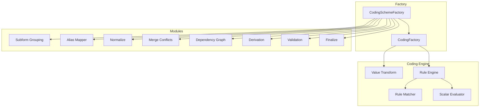
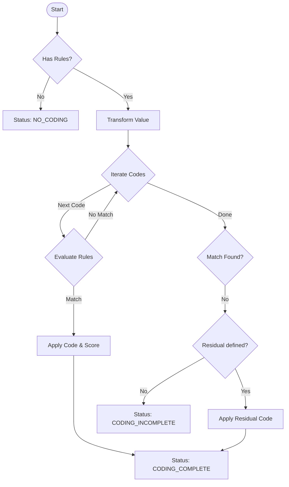
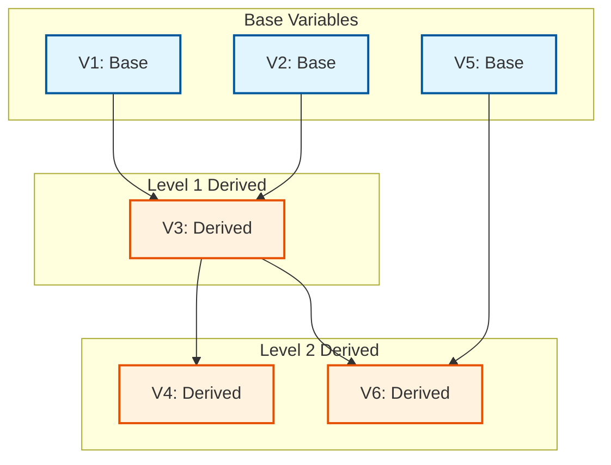
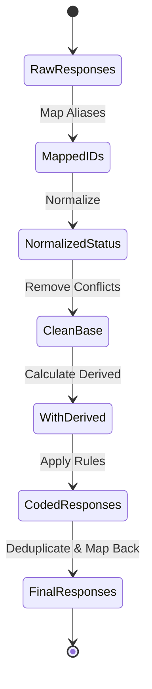

# Documentation Summary

## 📚 Documentation Overview

This repository now includes comprehensive documentation for the coding process with detailed diagrams and explanations.

## 📖 Available Documentation

### 1. **[CODING_PROCESS.md](./CODING_PROCESS.md)** (18 KB)
**Complete technical documentation with architecture diagrams**

**Contents:**
- High-level architecture overview
- Module architecture diagram
- Complete coding pipeline flow with visual diagrams
- Data flow transformation diagrams
- Rule-based coding logic flowchart
- Dependency resolution system
- Detailed component descriptions
- Status flow and transitions
- Error handling strategies
- Advanced features
- Performance considerations
- Testing guidelines
- Debugging tips

**Best for:** Developers who need to understand the internal workings, modify the codebase, or debug complex issues.

### 2. **[QUICK_REFERENCE.md](./QUICK_REFERENCE.md)** (10 KB)
**Quick reference guide for common operations**

**Contents:**
- Quick start examples
- Process flow overview
- Key concepts (statuses, variable types, rule types)
- Common operations with code examples
- Module reference table
- Processing parameters reference
- Debugging techniques
- Code examples for typical scenarios
- Best practices
- Troubleshooting guide

**Best for:** Developers who need quick answers, code snippets, or troubleshooting help.

### 3. **[README.md](./README.md)** (11 KB)
**Main package documentation and API reference**

**Contents:**
- Installation instructions
- Links to all documentation
- Public API exports
- Core concepts
- Usage examples
- Version history
- External references

**Best for:** Getting started with the package and understanding the public API.

## 🎨 Visual Diagrams

The documentation includes four professional diagrams:

### 1. **Coding Process Flow**


Shows the 8 stages of the coding pipeline from input to output.

### 2. **Module Architecture**


Displays the system's modular structure and how components interact.

### 3. **Rule Coding Logic**


Flowchart showing the decision tree for rule-based coding.

### 4. **Dependency Resolution**


Illustrates how derived variables are processed based on dependencies.

### 5. **Data Flow Diagram**


Shows how data transforms through each stage of the pipeline.

## 🚀 Getting Started

### For New Users
1. Start with **README.md** for installation and basic usage
2. Check **QUICK_REFERENCE.md** for code examples
3. Refer to **CODING_PROCESS.md** for deeper understanding

### For Developers
1. Review **CODING_PROCESS.md** to understand the architecture
2. Study the visual diagrams to grasp the flow
3. Use **QUICK_REFERENCE.md** for common patterns
4. Consult the module reference for specific components

### For Troubleshooting
1. Check the **Troubleshooting** section in QUICK_REFERENCE.md
2. Review **Error Handling** in CODING_PROCESS.md
3. Enable error logging as shown in the debugging section

## 📊 Documentation Structure

```
responses/
├── README.md                  # Main package documentation
├── CODING_PROCESS.md         # Detailed technical documentation
├── QUICK_REFERENCE.md        # Quick reference guide
└── .gemini/antigravity/brain/
    └── [diagrams]/           # Visual diagrams (5 images)
```

## 🎯 Key Topics Covered

### Architecture
- Two main factories: `CodingFactory` and `CodingSchemeFactory`
- 11 specialized modules handling different aspects
- Pipeline-based processing architecture

### Processing Pipeline
1. Input (responses + coding scheme)
2. Grouping (by subform)
3. Normalization (status standardization)
4. Conflict Resolution (derived/base conflicts)
5. Dependency Planning (build graph)
6. Derivation (compute derived values)
7. Coding (apply rules)
8. Output (finalize and deduplicate)

### Rule Types
- String matching (exact, regex)
- Numeric matching (exact, ranges, comparisons)
- Array handling (position-based matching)
- Processing options (case, whitespace, sorting)

### Variable Types
- BASE: Raw responses
- Derived: SUM, UNIQUE_VALUES, SOLVER, CONCAT_TEXT, etc.
- Support for complex dependency chains

### Status Management
- 11 different status values
- Clear status transitions
- Error status handling

## 🔧 Maintenance

### Updating Documentation

When making code changes:

1. **Update CODING_PROCESS.md** if:
   - Architecture changes
   - New modules are added
   - Pipeline stages are modified
   - New features are added

2. **Update QUICK_REFERENCE.md** if:
   - New common operations are added
   - API changes affect examples
   - New troubleshooting scenarios emerge

3. **Update README.md** if:
   - Public API changes
   - Installation process changes
   - Version information updates

### Regenerating Diagrams

If the process flow changes significantly, diagrams may need to be regenerated. The diagrams are currently stored in:
```
.gemini/antigravity/brain/de31e776-33df-488e-b91b-174020304231/
```

## 📈 Documentation Metrics

- **Total Documentation**: ~38 KB
- **Visual Diagrams**: 5 professional diagrams
- **Code Examples**: 10+ working examples
- **Coverage**: All major components and features documented

## 🎓 Learning Path

### Beginner
1. Read README.md introduction
2. Try the "Quick start" example
3. Review key concepts in QUICK_REFERENCE.md

### Intermediate
1. Study the process flow diagram
2. Understand status transitions
3. Learn about derived variables
4. Practice with code examples

### Advanced
1. Deep dive into CODING_PROCESS.md
2. Study module architecture
3. Understand dependency resolution
4. Review performance considerations
5. Explore error handling strategies

## 🔍 Finding Information

### "How do I...?"
→ Check **QUICK_REFERENCE.md** first

### "Why does it work this way?"
→ See **CODING_PROCESS.md** for detailed explanations

### "What's the API?"
→ Refer to **README.md** for public API

### "Something's not working"
→ Troubleshooting section in **QUICK_REFERENCE.md**

## 📞 Additional Resources

- **IQB Specifications**: https://iqb-specifications.github.io/
- **npm Package**: https://www.npmjs.com/package/@iqb/responses
- **GitHub Repository**: https://github.com/iqb-berlin/responses
- **Coding Info (German)**: https://iqb-berlin.github.io/tba-info/coding/response-status.html

## ✅ Documentation Checklist

- [x] Architecture overview with diagrams
- [x] Complete pipeline flow documentation
- [x] Module structure and responsibilities
- [x] Rule-based coding logic
- [x] Dependency resolution system
- [x] Status flow and transitions
- [x] Error handling strategies
- [x] Code examples for common scenarios
- [x] Quick reference guide
- [x] Troubleshooting guide
- [x] Performance considerations
- [x] Testing guidelines
- [x] Debugging tips
- [x] Best practices
- [x] Visual diagrams (5 total)

---

**Last Updated**: January 8, 2026
**Version**: 5.0
**Maintainer**: IQB - Institut zur Qualitätsentwicklung im Bildungswesen
